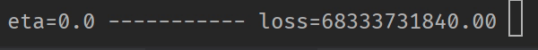
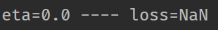
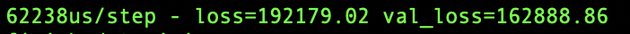

# House Price Predictor

House price predictor based on the UK land registry data using machine learning and TensorFlow (with Node.js and TypeScript).

# How to use

Download the [land registry data](https://www.gov.uk/government/collections/price-paid-data) in csv. 

* Edit the downloaded file to make sure it's not much bigger than 1 GB.
* Run ``npm install``.
* Edit the file ``config.json`` to point to the downloaded csv.
* Run ``npm start`` to train the model.
* Wait for the model to be trained.
* Run ``npm run query`` to query the model.

# 2019 Hackathon 
For the 2019 hackathon at Rightmove I decided to try to learn some machine learning. Nowadays everything is automated, so it should be easy, or so I thought.


## Motivations and goals
I wanted to understand how machine learning works and do it with TensorFlow in Node.js and TypeScript. To do that I tried predicting the price of houses. [Land registry](https://www.gov.uk/government/collections/price-paid-data) has publicly available data for the transaction of houses in England and Wales. That includes things like the postcode of the property and the price it was sold.

My Goal was to estimate the price of a house based on the postcode, property type, and if it was newly built.


## Learnings
Turns out machine learning is not black magic. And it is not as automated as I thought.

You provide it with a number of inputs and outputs (in numerical values) and you train a model with it. After the model is trained you can query it with the same number of inputs and the model will predict the output. Seems pretty great, and it is. But it is not really automated. The model provides different importance (or weights) to the different inputs to calculate the output. That is a matrix multiplication.

There are several algorithms out of the box in TensorFLow that will try changing the weights to get a good prediction. The learning rate needs to be passed into that algorithm to determine how fast is it going to try to change those weights. If the learning rate is to high it will be fast but it won't get accurate results (as the changes are too big and the predictions will not reach accuracy), but if it is too low it will take an immense amount of time to get to actually get the correct weights.

You also need to provide it with a loss function, that will calculate how far off is the prediction from the actual value. Again there are several loss functions out of the box. The loss function needs to match your type of machine learning problem (regression where we predict any number like the price of a house vs categorization where we predict some out of a list or enum like the property type of a house).

We want our machine learning pipeline to genera small a loss, because that means it is accurate but we also want that in a reasonable amount of time.



We need to reserve a percentage of our date for testing or valuation (eg. 15%).

Then we convert the data into the appropriate format, converting strings to numbers, and enums to more numbers using [one shot](https://en.wikipedia.org/wiki/One-shot_learning), we shuffle the date to be more accurate. and we train the model iterating over the data (some suggest doing it for over 100 times).

But if the prediction is too complex we will need to introduce more hidden layers. That means add more matrix multiplications between the inputs and outputs with different weights. People recommend having the same number of layers as inputs (or features) as a starting point.


## Struggles
All seams very easy to do in theory, but in practice it's a bit more tricky.

What learning algorithm are you supposed to use? What loss function is better for your case? What learning rate should you set? And what are you supposed to do with the hidden layers? How many should you add? And with how many inputs?

There is a lot of information online, but there is not a clear path about how you should choose the correct options for each one of those. Most options are divided between classification (eg. and enum) and regression (a real number), but after that most people suggest to try things out. Which leaves a lot of room for creativity. But it is hard to know how to choose and how to debug to see how to improve it.

If anything is too off your loss will be NaN, and your model is worthless. Reducing the learning rate can definitely help to prevent NaN, but it is not warranted. 



Using big amounts of data seems easy in TensorFlow. In my case it was [reading from a csv](https://js.tensorflow.org/api/latest/#data.csv) that returns a Dataset that in theory can hold a potentially large collection of data. But when I tried reading the full land registry data that weights 4 GB I got this error:
```
RangeError [ERR_FS_FILE_TOO_LARGE]: File size (4347665610) is greater than possible Buffer: 2147483647 bytes
As you see the read operation fails because Node JS only allows you to read 2GB data into its buffer and no more. How to overcome that. When you are doing I/O intensive operations (Copy, Process, Zip), it is better to consider system memory.
So I had to reduce the number of data. There might be other ways of loading the data, but none were fast enough for a hackathon.
```
Finally when training and changing something you can see how the loss progresses in real time, but if you want to get the full picture you need to wait until the model is trained which can take a very long time when the data is that big.

## Does it work?
It does predict the values, but sadly it is not currently very accurate. The pipeline could be improved and with more time to train the model the learning rate could be smaller as well. Currently it has a loss (or deviation) of 163K when predicting the price of a house.



## Wrap up
I had a lot of fun doing this project, I learned a lot of things about machine learning, and I produce a not very accurate model. All in all I think it was a great hackathon. If you want to see the code or try it for yourself you can find it on [my Github](https://github.com/jucallej/House-Price-Predictor)?.
